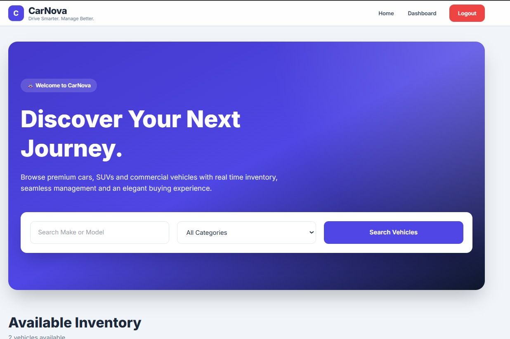
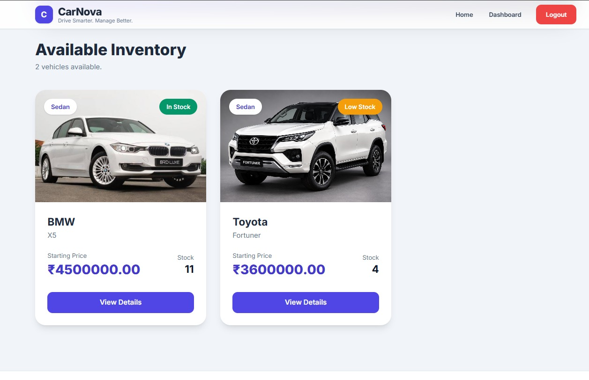
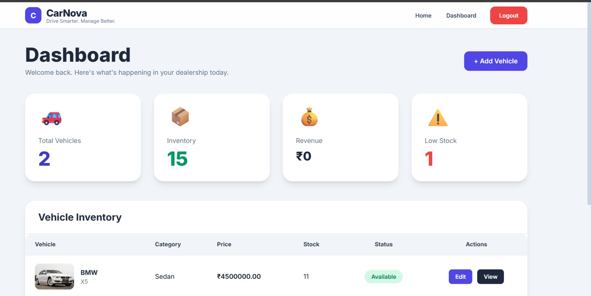
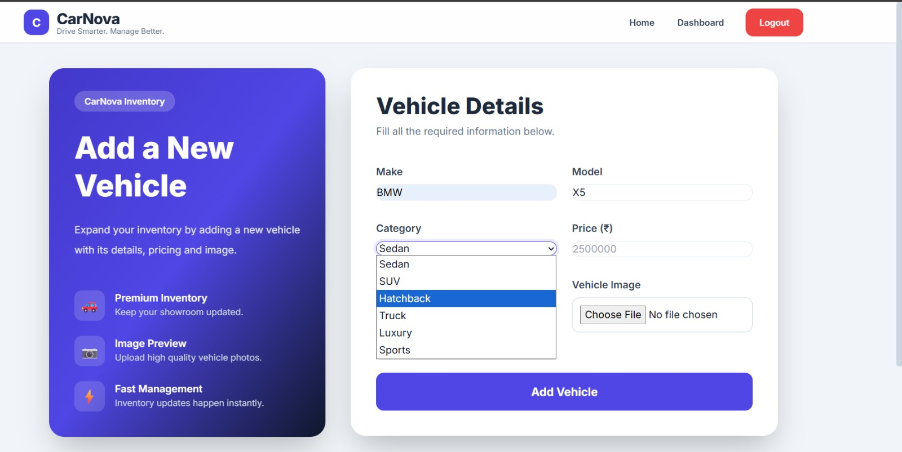
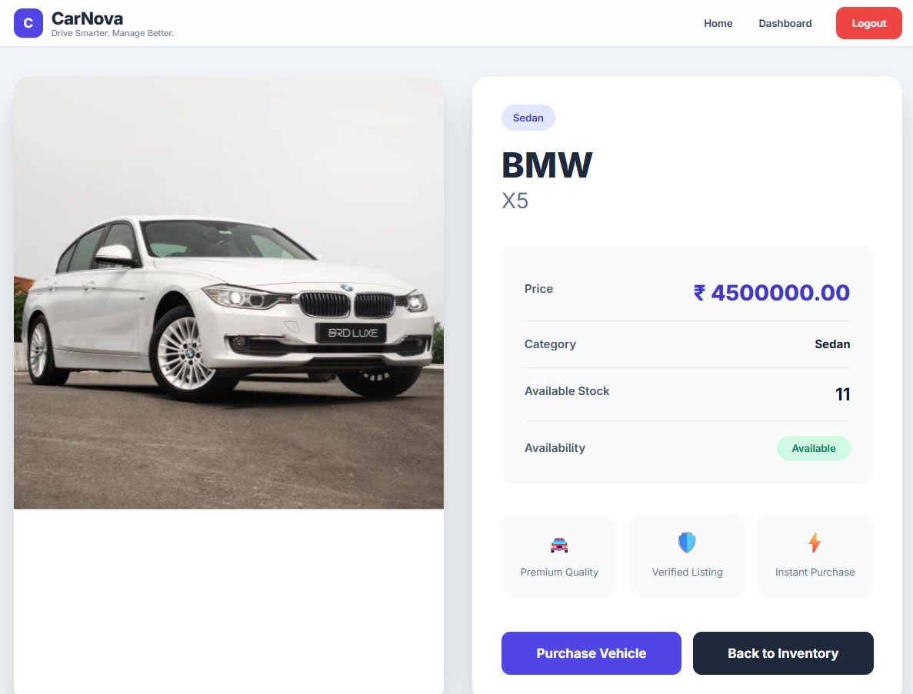
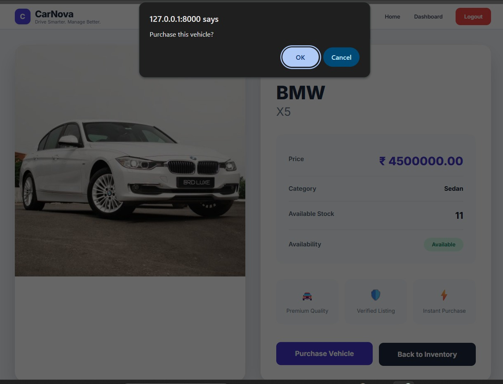
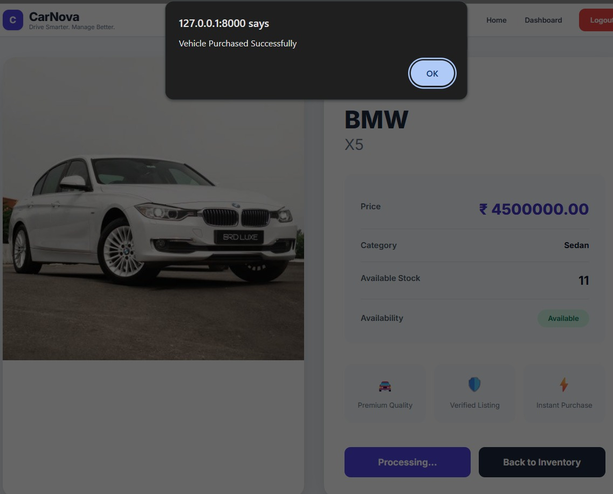
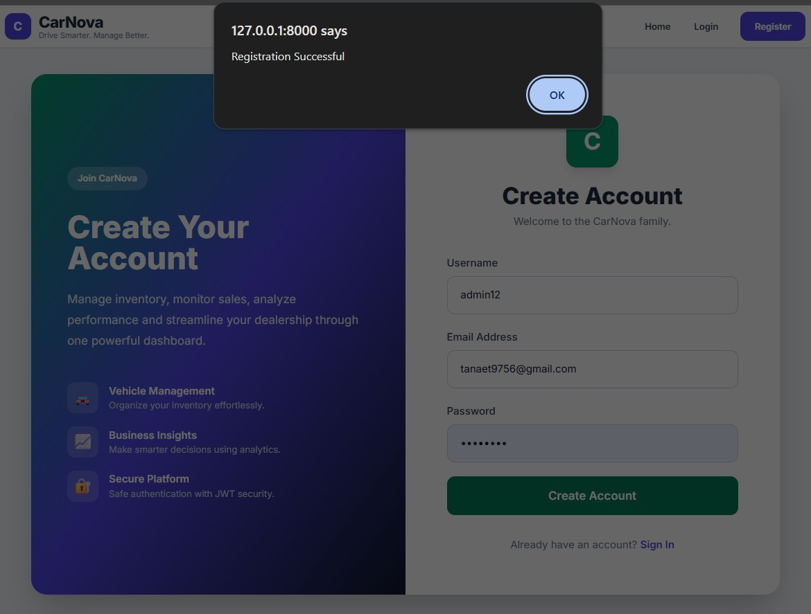

# 🚗 CarNova
## Smart Vehicle Dealership Inventory Management System

CarNova is a modern Vehicle Dealership Inventory Management System developed using **Django**, **Django REST Framework**, **JWT Authentication**, **SQLite**, **HTML5**, **Tailwind CSS**, and **JavaScript**.

The application allows dealerships to efficiently manage vehicle inventory, monitor stock levels, upload vehicle images, securely authenticate users, and simulate vehicle purchases through a modern, responsive interface.

---

# ✨ Features

- 🔐 JWT Authentication
- 👤 User Registration & Login
- 🚪 Secure Logout
- 🚗 Vehicle Inventory Management
- ➕ Add New Vehicles
- ✏️ Edit Vehicle Information
- 🖼️ Vehicle Image Upload
- 📄 Vehicle Detail Page
- 🛒 Purchase Vehicle
- 📦 Automatic Stock Reduction
- ⚠️ Low Stock Detection
- 📊 Dashboard Analytics
- 💰 Revenue Tracking
- 🔍 Vehicle Search & Category Filter
- 📱 Fully Responsive Design

---

# 🛠 Technology Stack

| Technology | Purpose |
|------------|---------|
| Django | Backend Framework |
| Django REST Framework | REST APIs |
| JWT | Authentication |
| SQLite | Database |
| HTML5 | Frontend |
| Tailwind CSS | Styling |
| JavaScript | Client-side Functionality |
| WhiteNoise | Static File Handling |

---

# 📸 Application Screenshots

## 🏠 Home Page

Browse available vehicles, search inventory, and filter by category.



---

## 🚘 Vehicle Inventory

Displays all available vehicles with stock information and pricing.



---

## 📊 Dashboard

Provides a complete overview of dealership statistics.

Features include:

- Total Vehicles
- Total Inventory
- Revenue
- Low Stock Vehicles
- Vehicle Inventory Table



---

## ➕ Add Vehicle

Add a new vehicle by entering its details and uploading an image.



---

## 🚗 Vehicle Details

Displays complete information about a selected vehicle.

Includes:

- Vehicle Image
- Category
- Price
- Stock
- Availability
- Purchase Button



---

## 🛒 Purchase Confirmation

The application asks for confirmation before purchasing a vehicle.



---

## ✅ Purchase Successful

Once purchased, inventory is automatically updated and a success message is displayed.



---

## 👤 User Registration

Secure user registration using JWT Authentication.



---

# 📊 Dashboard Analytics

The dashboard dynamically calculates:

- Total Vehicles
- Total Inventory
- Revenue
- Low Stock Vehicles

using live database records.

---

# 📁 Project Structure

```text
CarDealershipInventorySystem/
│
├── accounts/
├── backend/
├── frontend/
├── inventory/
├── vehicles/
├── templates/
├── static/
├── media/
├── screenshots/
│   ├── add_vehicle.jpeg
│   ├── dashboard.jpeg
│   ├── home.jpeg
│   ├── inventory.jpeg
│   ├── purchase-confirm.jpeg
│   ├── purchased.jpeg
│   ├── registrations.jpeg
│   └── vehicle.jpeg
│
├── manage.py
├── requirements.txt
├── prompts.md
└── README.md
```

---

# 🚀 Installation

Clone the repository

```bash
git clone https://github.com/your-username/CarDealershipInventorySystem.git
```

Navigate to the project directory

```bash
cd CarDealershipInventorySystem
```

Create a virtual environment

```bash
python -m venv .venv
```

Activate the environment

### Windows

```bash
.venv\Scripts\activate
```

### Linux / macOS

```bash
source .venv/bin/activate
```

Install dependencies

```bash
pip install -r requirements.txt
```

Apply migrations

```bash
python manage.py migrate
```

Run the development server

```bash
python manage.py runserver
```

Open your browser:

```
http://127.0.0.1:8000/
```

---

# 🔐 Authentication

The application uses **JWT Authentication** provided by Django REST Framework SimpleJWT.

Authenticated endpoints require a valid Bearer Token.

---

# 📡 API Endpoints

| Method | Endpoint | Description |
|--------|----------|-------------|
| POST | `/api/auth/register/` | Register User |
| POST | `/api/auth/login/` | Login |
| GET | `/api/vehicles/` | View Vehicles |
| POST | `/api/vehicles/` | Add Vehicle |
| PUT | `/api/vehicles/<id>/` | Update Vehicle |
| DELETE | `/api/vehicles/<id>/` | Delete Vehicle |
| POST | `/api/vehicles/<id>/purchase/` | Purchase Vehicle |

---

# 🎯 Future Enhancements

- PostgreSQL Integration
- Cloud Image Storage
- Email Notifications
- Sales Reports
- Vehicle Booking
- Customer Management
- Interactive Charts
- Admin Role Management

---

# 👨‍💻 Author

**Developed as an MCA Major Project**

**Project Title:**

**CarNova: Smart Vehicle Dealership Inventory Management System**

---

# 📜 License

This project is developed solely for educational purposes.